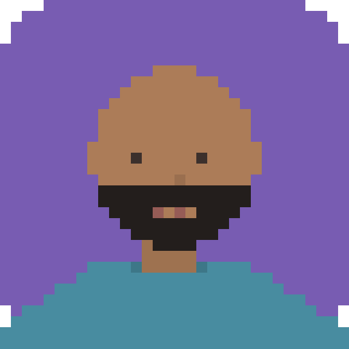

# The Council

Thinking lenses of ten founders and operators — how they think and decide — plus an **orchestrator** that routes any question to the right advisor(s). Bring a decision; The Council shows you which of the ten are best suited to answer (with a fit score), answers in their voices, and tells you where they disagree.

## The Council

<table>
<tr>
<td align="center" width="20%"><br><b><a href="lenses/jeff-bezos.md">Jeff Bezos</a></b><br><sub>Founder</sub><br><sub>Amazon</sub></td>
<td align="center" width="20%"><br><b><a href="lenses/alex-hormozi.md">Alex Hormozi</a></b><br><sub>Founder</sub><br><sub>Acquisition.com</sub></td>
<td align="center" width="20%"><br><b><a href="lenses/steve-jobs.md">Steve Jobs</a></b><br><sub>Co-founder</sub><br><sub>Apple</sub></td>
<td align="center" width="20%"><br><b><a href="lenses/naval-ravikant.md">Naval Ravikant</a></b><br><sub>Founder</sub><br><sub>AngelList</sub></td>
<td align="center" width="20%"><br><b><a href="lenses/demis-hassabis.md">Demis Hassabis</a></b><br><sub>CEO</sub><br><sub>Google DeepMind</sub></td>
</tr>
<tr>
<td align="center" width="20%"><br><b><a href="lenses/dario-amodei.md">Dario Amodei</a></b><br><sub>CEO</sub><br><sub>Anthropic</sub></td>
<td align="center" width="20%"><br><b><a href="lenses/sam-altman.md">Sam Altman</a></b><br><sub>CEO</sub><br><sub>OpenAI</sub></td>
<td align="center" width="20%"><br><b><a href="lenses/elon-musk.md">Elon Musk</a></b><br><sub>CEO</sub><br><sub>Tesla &amp; SpaceX</sub></td>
<td align="center" width="20%"><br><b><a href="lenses/larry-fink.md">Larry Fink</a></b><br><sub>CEO</sub><br><sub>BlackRock</sub></td>
<td align="center" width="20%"><br><b><a href="lenses/peter-thiel.md">Peter Thiel</a></b><br><sub>Co-founder</sub><br><sub>PayPal &amp; Palantir</sub></td>
</tr>
</table>

<sub>Pixel-art avatars are stylized representations, not real likenesses.</sub>

## Install on Claude

**Claude Code (recommended):**
```bash
git clone https://github.com/irshaid/the-council.git
cd the-council
claude
```
The included `CLAUDE.md` turns Claude into the Council orchestrator automatically. Just ask a question.

**Claude.ai / Claude Desktop (Projects):**
1. Create a new Project.
2. Paste the contents of [`orchestrator.md`](orchestrator.md) into the Project's custom instructions.
3. Upload the `lenses/` files to the Project knowledge.
4. Ask any question in the Project.

## How it works
Ask anything — *"Should I raise prices or add a tier?"*, *"Do I hire now or wait?"* — and the orchestrator:
1. **Shows a fit table** — each advisor scored 0–100% on how suited they are to *this* question, with a one-line reason.
2. **Consults the top advisors** — answering in each one's voice: how they read it, their move, their blind spot.
3. **Synthesizes** — where they agree, where they clash, and the sharpest takeaway.

## Consult a single lens manually
Open any file in [`lenses/`](lenses/) (or paste it into any AI assistant) and ask:

> *"Act as this lens. Here's my decision: `<...>`. Give me your heuristics, your verdict, and the one blind spot I should watch."*

Each lens is an approximation from the public record — a tool to sharpen your thinking, not the real person. Every lens lists its own blind spots.

## Contributing
PRs welcome. Keep lenses evidence-based, follow the same format, and be honest about blind spots.

## License
CC BY 4.0.
